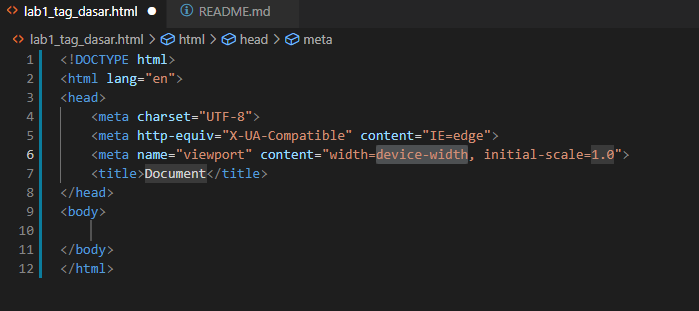

## Belajar HTML

**Nama     : Fery Affandi**  
**Kelas    : TI.20.A.1**   
**NIM      : 312010018**  

## Tugas

Mendapatkan tugas dari dosen Pemrograman Web pada pertemuan ke-2 ,yaitu:

## Langkah-langkah membuat web sederhana menggunakan HTML melalui vscode:  

1. Buka Vscode dan akan muncul tampilan awal seperti dibawah ini 

2. Kemudian buat file dengan format lab1_tag_dasar.html 

3. Kemudian buka formatnya di Vscode

4. lalu menulis kode awal dengan menuliskan html:5

