## Belajar HTML

**Nama     : Fery Affandi**  
**Kelas    : TI.20.A.1**   
**NIM      : 312010018**  

## Tugas

Mendapatkan tugas dari dosen Pemrograman Web pada pertemuan ke-2 ,yaitu:

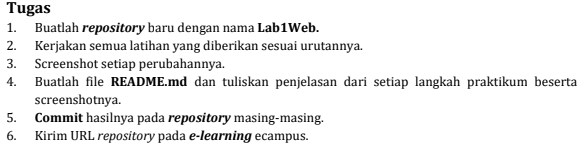

## Langkah-langkah membuat web sederhana menggunakan HTML melalui vscode:  

**Buka Vscode dan akan muncul tampilan awal seperti dibawah ini** 

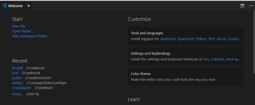

**Kemudian buat file dengan format lab1_tag_dasar.html** 

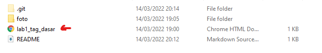

**Kemudian buka formatnya di Vscode**

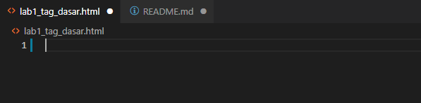

**Lalu menulis kode awal dengan menuliskan html:5 dan hasilnya seperti dibawah ini**

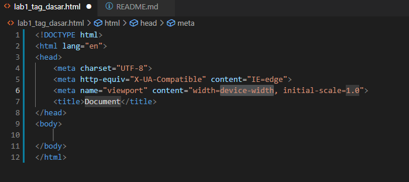

kemudian mmengubah nama web menjadi Belajar HTML

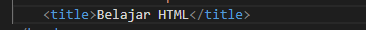

dan tampilan web akan seperti ini

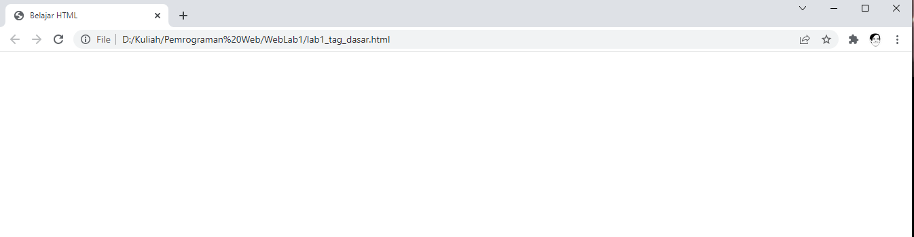

## 1. Lalu membuat Paragraf

selanjutnya membuat paragraf sederhana seperti dibawah ini

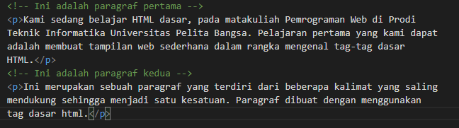

lalu disimpan perubahannya dan lakukan refresh pada web html tersebuat dan terajadi perubahan seperti dibawah ini

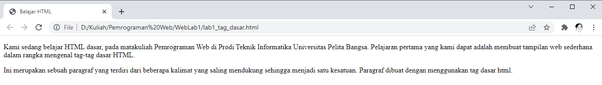

kemudian atur paragraf seperti dibawah ini dan lihat lah perubahannya.

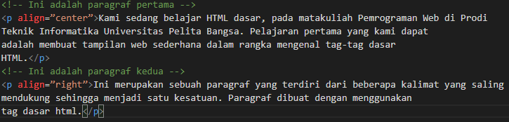

kemudian hasil formatnya akan seperti ini.

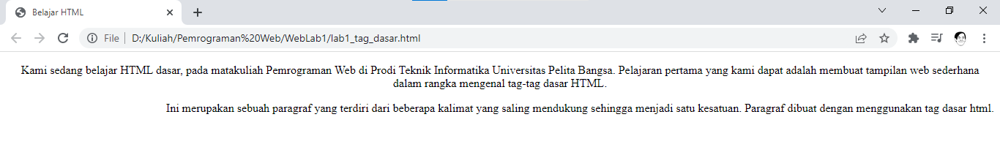

Simpan kembali dan amatilah perubahannya dengan 
melakukan refresh pada web browser.
Selanjutnya silahkan  diubah-ubah atributnya (<i>align => justify, left, right, dan center</i>) untuk melihat
perbedaan lainnya.

## 2. Menambahkan Judul

Seperti sudah dijelaskan pada materi bahwa judul (h) memiliki 6 level yaitu mulai h1 sampai h6.
Kemudian tambahkan judul h1 <b>sebelum</b> paragraf pertama dan tambahkan sub judul h2 <strong>sebelum</strong>
paragraf kedua.

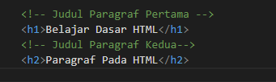

Simpan perubahan tersebut dan lihat dengan melakukan refresh pada browser.

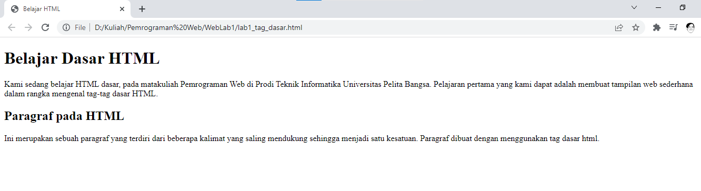

## 3. Memformat Teks

Kita akan mencoba memformatan teks yang ada pada paragraf yang sudah ada sebelumnya, mengacu kepada
penjelasan materi pemformatan teks, sehingga tampilan codingannya seperti ini.

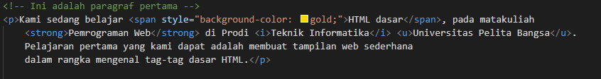

setelah membuat codingan seperti diatas, kalian bisa simpan kemudian lihatlah perubahannya di browser.

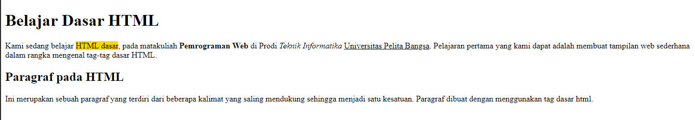

## 4. Menyisipkan gambar

Untuk menyisipkan gmbar, siapkan gambar yang akan disisipkan pada halaman web, kemudian
simpan file gambar tersebut satu folder dengan file dokumen html.

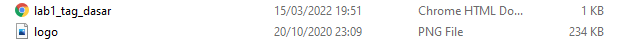

Kemudian tambahkan tag img setelah paragraf yang kedua, dengan menambahkan heading 3
sebelumnya.

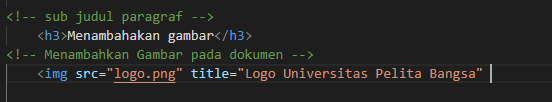

Simpan perubahannya, dan lihar kembali browser.

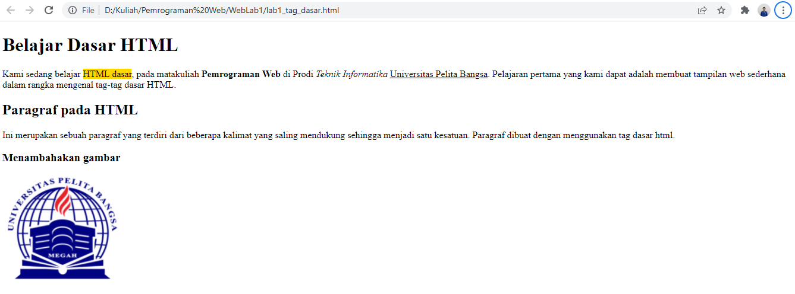

Gambar akan ditampilkan apa adanya sesuai dengan ukuran aslinya. Untuk mengatur ukuran
gambar, dapat digunakan atribut witdh dan height dengan nilai integer yang disesuaikan.

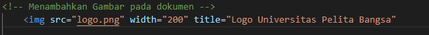

## 5. Menambahkan Hyperlink

Tambahkan hyperlink pada dokumen sebelum heading 1 seperti berikut.

Buat satu file lagi dengan nama lab1_halaman2.html kemudian isi dokumen tersebut dengan tag
html dasar dan dengan isi bebas, boleh mengcopy dari halaman sebelumnya.

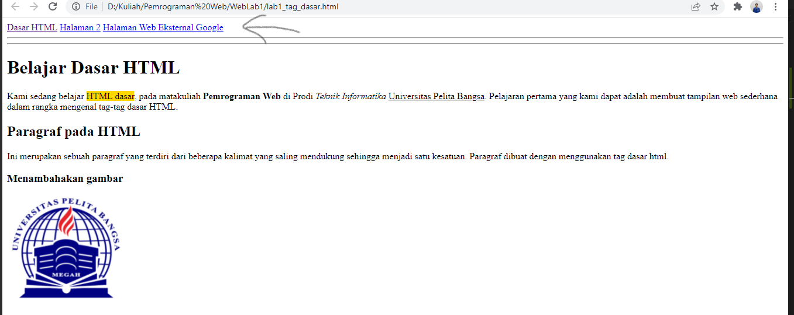
