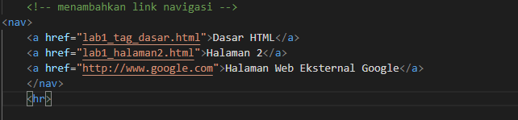
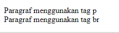
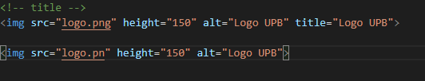

## Belajar HTML

**Nama     : Fery Affandi**  
**Kelas    : TI.20.A.1**   
**NIM      : 312010018**  

## Tugas

Mendapatkan tugas dari dosen Pemrograman Web pada pertemuan ke-2 ,yaitu:

## Langkah-langkah membuat web sederhana menggunakan HTML melalui vscode:  

**Buka Vscode dan akan muncul tampilan awal seperti dibawah ini** 

**Kemudian buat file dengan format lab1_tag_dasar.html** 

**Kemudian buka formatnya di Vscode**

**Lalu menulis kode awal dengan menuliskan html:5 dan hasilnya seperti dibawah ini**

kemudian mmengubah nama web menjadi Belajar HTML

dan tampilan web akan seperti ini

## 1. Lalu membuat Paragraf

selanjutnya membuat paragraf sederhana seperti dibawah ini

lalu disimpan perubahannya dan lakukan refresh pada web html tersebuat dan terajadi perubahan seperti dibawah ini

kemudian atur paragraf seperti dibawah ini dan lihat lah perubahannya.

kemudian hasil formatnya akan seperti ini.

Simpan kembali dan amatilah perubahannya dengan 
melakukan refresh pada web browser.
Selanjutnya silahkan  diubah-ubah atributnya (<i>align => justify, left, right, dan center</i>) untuk melihat
perbedaan lainnya.

## 2. Menambahkan Judul

Seperti sudah dijelaskan pada materi bahwa judul (h) memiliki 6 level yaitu mulai h1 sampai h6.
Kemudian tambahkan judul h1 <b>sebelum</b> paragraf pertama dan tambahkan sub judul h2 <strong>sebelum</strong>
paragraf kedua.

Simpan perubahan tersebut dan lihat dengan melakukan refresh pada browser.

## 3. Memformat Teks

Kita akan mencoba memformatan teks yang ada pada paragraf yang sudah ada sebelumnya, mengacu kepada
penjelasan materi pemformatan teks, sehingga tampilan codingannya seperti ini.

setelah membuat codingan seperti diatas, kalian bisa simpan kemudian lihatlah perubahannya di browser.

## 4. Menyisipkan gambar

Untuk menyisipkan gmbar, siapkan gambar yang akan disisipkan pada halaman web, kemudian
simpan file gambar tersebut satu folder dengan file dokumen html.

Kemudian tambahkan tag img setelah paragraf yang kedua, dengan menambahkan heading 3
sebelumnya.

Simpan perubahannya, dan lihar kembali browser.

Gambar akan ditampilkan apa adanya sesuai dengan ukuran aslinya. Untuk mengatur ukuran
gambar, dapat digunakan atribut witdh dan height dengan nilai integer yang disesuaikan.

## 5. Menambahkan Hyperlink

Tambahkan hyperlink pada dokumen sebelum heading 1 seperti berikut.

Buat satu file lagi dengan nama lab1_halaman2.html kemudian isi dokumen tersebut dengan tag
html dasar dan dengan isi bebas, boleh mengcopy dari halaman sebelumnya.

## Jawab Pertanyaan Berikut 

1. Lakukan perubahan pada kode sesuai dengan keinginan anda, amati perubahannya adakah
error ketika terjadi kesalahan penulisan tag?  
2. Apa perbedaan dari tag `
` dengan tag ` `, berikan penjelasannya!  
3. Apa perbedaan atribut title dan alt pada tag ``, berikan penjelasannya!  
4. Untuk mengatur ukuran gambar, digunakan atribut width dan height. Agar tampilan gambar
proporsional sebaiknya kedua atribut tersebut diisi semua atau tidak? Berikan penjelasannya!  
5. Pada link tambahkan atribut target dengan nilai atribut bervariasi <i><b>(_blank, _self, _top,
_parent)</i></b>, apa yang terjadi pada masing-masing nilai antribut tersebut?  

## Jawaban Pertanyaan

1. Saya akan melakukan perubahan pada tag HTML,
        gambar yang dibawah ini merupakan <b>syntax HTML</b>di aplikasi VScode sebelum saya merubahnya.  
    
    

    Lalu ketika saya hilangkan akhiran pada Tag `</h1>` menjadi `<h1>`, maka yang akan terjadi adalah seluruh elemen dibawah tag tersebut akan berubah mengikuti Tag `<h1>`, dikarenakan tidak ada akhiran/penutup Tag tersebut.

2. Tag `
` berfungsi untuk memberi perintah <b>paragraf</b>pada halaman HTML,
sedangkan Tag ` ` berfungsi untuk memberikan perintah <b>breakline</b> atau <b>baris baru, contohnya:</b>

3. `title` berfungsi untuk menunjukan judul pada gambar, lalu `alt`
berfungsi untuk menunjukan sebuah alternatif teks <i>(teks pengganti)</i> 
yang akan muncul apabila gambar tidak dapat ditampilkan. 

dan ini codingannya  

pada codingan <b>`alt`</b> sengaja ditulis nama file tidak lengkap, dikarenakan hanya untuk menampilkan fungsi dari alt

